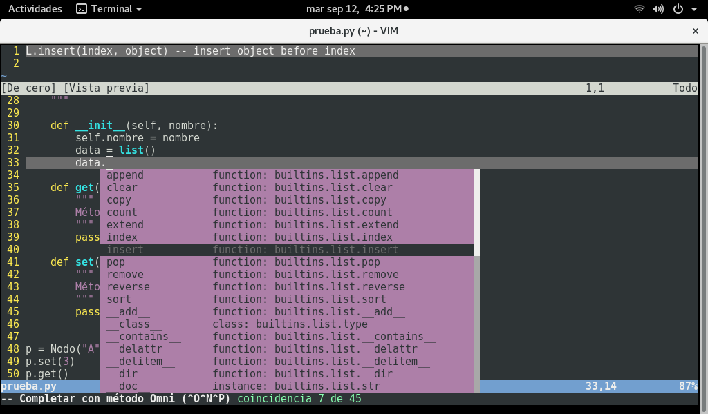

# VimTip 003.

## Autocompletado para Python.

Es posible integrar a *Vim* el autocompletado de sintaxis para Python a través de los repositorios de *Debian/GNU Linux* y derivados, mediante la instalación de los paquetes:

>$ sudo aptitude install vim-python-jedi
>$ vim-addons install python-jedi

