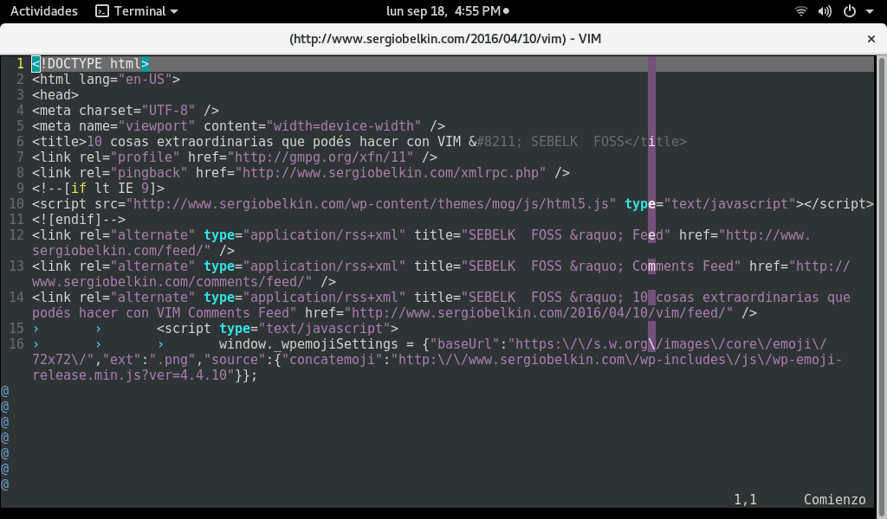

# VimTip 011.

## Editar un archivo web al vuelo.

Para editar una _copia_ de cualquier archivo vía _http_ o _ftp_, basta con abrirlo directamente desde la terminal con <span style="color:green">**_Vim_**</span>, como por ejemplo ```$ vim http://www.sergiobelkin.com/2016/04/10/vim/```


