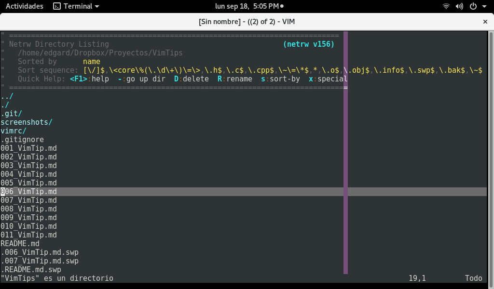

# VimTip 012.

## Explorador de archivos embebido.

Para acceder al explorador de archivos embebido de <span style="color:green">**_Vim_**</span> basta con teclear en modo *Ex* ```: e .```



Además de los movimientos normales del cursor, estando en un directorio podremos ejecutar los siguientes comandos:

* ```o``` Abre el archivo sobre el que esté el cursor en una nueva ventana.
* ```O``` Abre el archivo sobre el que esté el cursor en la ventana previamente visitada (la última en la que estuvo el cursor que no sea la del explorador). Si sólo hay una ventana, su efecto es similar a ```o```.
* ```p``` Abre el archivo en una nueva ventana, y devuelve el cursor a la ventana del explorador.
* ```i``` Activa o desactiva la visualización de los datos adicionales del archivo (tamaño, fecha de la última modificación, etc). Cuando esta información no se está mostrando el comando ```i``` la muestra.Cuando se está mostrando este mismo comando la oculta.
* ```s``` Ordena la lista de archivos por el campo sobre el que esté colocado el cursor en ese momento (nombre, tamaño, o fecha).
* ```r``` Invierte el orden actual.
* ```c``` Convierte el directorio actual en directorio activo del sistema (es como si se ejecutara en la shell el comando ```cd DirectorioMostrado```).
* ```R``` Permite renombrar el archivo sobre el que esté el cursor.
* ```D``` Borra el archivo sobre el que esté el cursor.
